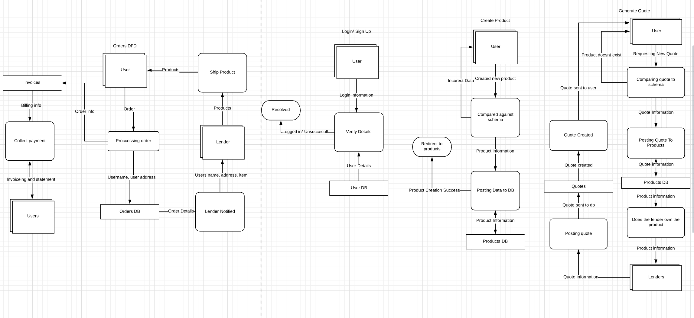
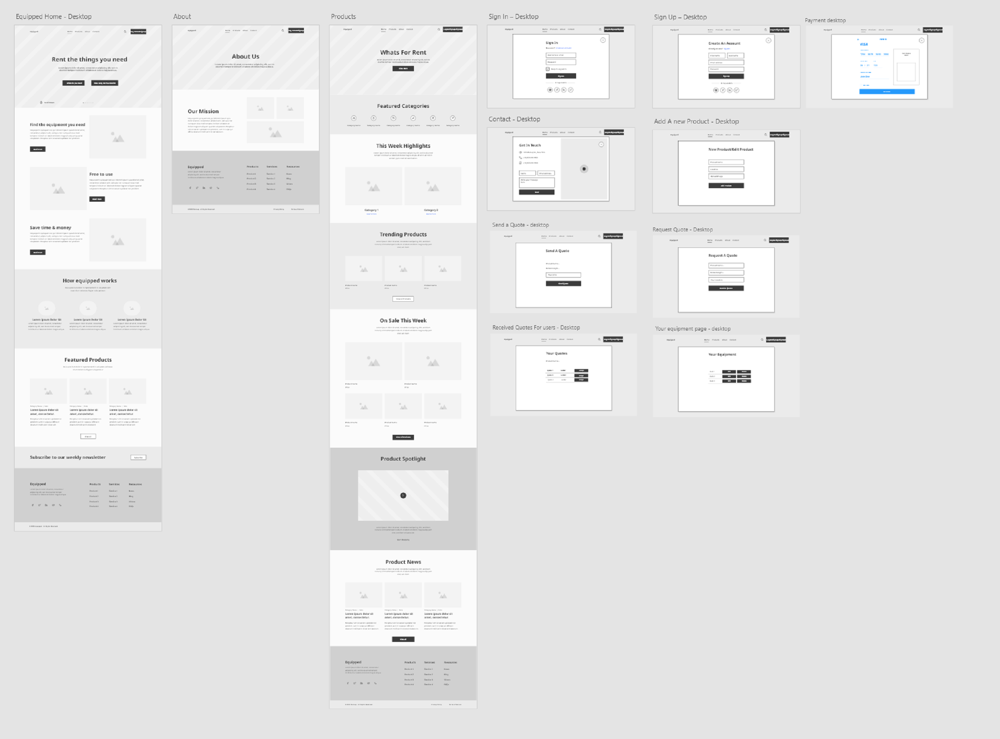
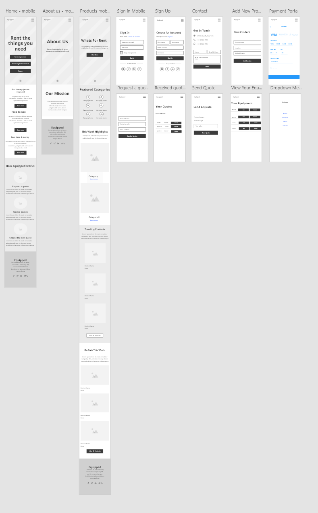
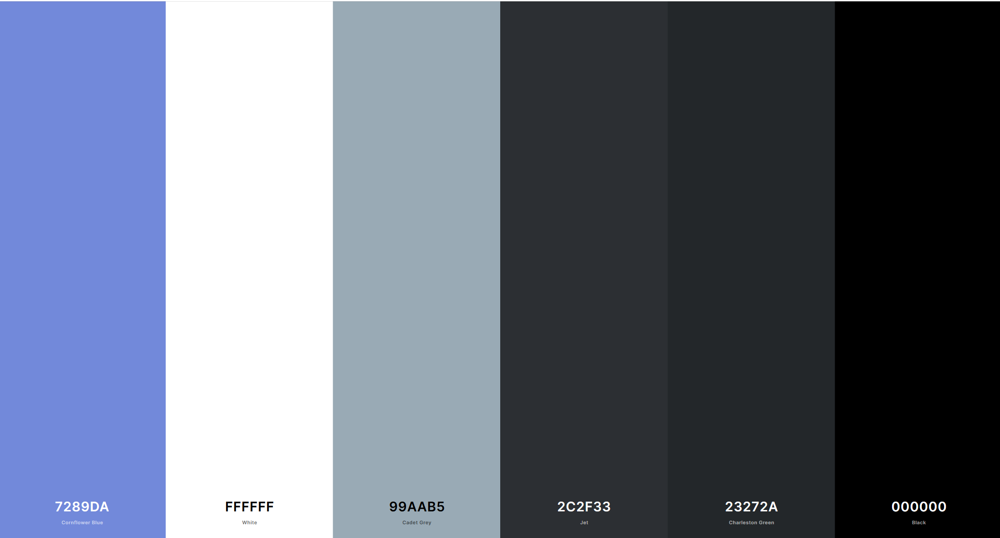

## Equipped

## T3A2-A - Full Stack App (Part A)

---

#### MERN Stack Application by Aiden Waring & Alexander Little

#### Deployable Link:
[www.alexandaidenchangetheworld.com.au](www.alexandaidenchangetheworld.com.au)

## R1

#### Purpose

The original vision of the application was to provide a service to users seeking to acquire technology equipment in a convenient, cost-effective format.

Acquiring new equipment and tech hardware can often be expensive and a large commitment. The concept originates from the demand to easily acquire hardware without the commitment and concern of purchasing an expensive piece of equipment for what may be a one-time need for it. There is also a demand for existing product owners to make the most out of their purchases.

Introducing Equipped - a peer-to-peer tendering platform for owner's to list their purchased equipment and have it lent out or rented to another user. Equipment owners who lend out their tools to users can place a tender or rent offer to generate an income for a allotted period of time. Equipped allows equipment owners to rent out their unused hardware to those who need it. Instead of selling a unused item, Equipped not only allows the owner to keep the item after it has been returned but also allow them to generate an a repeatable income, as lending out the item can result in more of an income than simply selling it.

Renters state how long they want to rent equipment for and the platform will provide them with a list of available tenders and their advertised costs. For example, a renter may be looking for a drone and a VR headset - the drone for the weekend and the headset for three weeks. If a group of lenders who own those pieces of equipment have listed that they are available for this time period, our drone searching friend will have the choice to pick from which lender they would like to rent from, with each tender / equipment listing showing the item, condition, availability and price.

Equipped users will be able to list their own equipment and tender them to available renters for a set price. Users who are searching to rent the available equipment will be able to view a list of available tenders of items to rent within their search filters. These users will be provided with the options to either deny or accept the tender. Denying the listing will remove the tender from their search and accepting a given tender will direct them to a payment gateway to complete the transaction, where the Equipped platform takes an 8% commission. Once the transaction has been completed, delivery instructions will be provided depending whether the listing is a drop-off or shipment arrangement.

By allowing users to rent existing equipment, the platform also encourages the reuse of existing hardware from other people across the world to help minimise product waste and promote the recycling and reuse of underused equipment.

#### Functionality and Features

A site guest (user without the use of an account) may:

* View equipment that is available to rent
* Create an account to both lend and rent equipment
* View information about the platform, it's purpose and contact information

A registered site user (renter) may:

* Search the platform's database for equipment available for rent
* Request, view and receive quotes from lenders
* Sign in and out of their account
* Make changes to their account's profile information
* Check lender's profile information
* Make updates and changes to their own profile page
* Accept or deny trade requests
* Authorise payments to lenders through the site
* Apply to become a authorised lender site user
* Review past transactions, including previously rented items and it's owner

An authorised lender user may:

* Create new listings for users to view
* View any rental requests that renters may post that are relevant to the products they own
* Review the lender's information

#### Target Audience

The target audience for this application is any individuals looking to acquire tech hardware and equipment for a certain period of time, and those who wish to generate income by providing their own hardware to rent. The platform connects these two demographics and allows them to trade directly. The platform caters to a large audience of people who may want to use a piece of equipment but may only need it for a certain event, function or time frame. The site also allows users to make use of equipment for a much cheaper price than purchasing it.

#### Tech Stack

* MongoDB - used for the database, this was chosen because a user may have multiple items they are looking to rent out
* Express -  used to help facilitate CRUD requests with Node.js
* Node.js -  used for the back end and will help with creating a server
* React -  used to create the UI
* HTML5 & CSS3 - used for styling the UI components
* Heroku - used to host the server side of the application to make Api calls
* Netlify - used to host the client side of the website
* Stripe - used as the payment gateway for equipment renting purchases
* Bootstrap - React Bootstrap framework used to streamline the design process of the UI

## R2

#### Dataflow Diagram

## R3

#### Application Architecture Diagram

*Shows almost flawless understanding of the high-level structure of the app*

## R4

#### User Stories

## R5

##### Desktop Wireframe 

[Link To Desktop](https://xd.adobe.com/view/4879c0bc-ca88-400b-8dac-c6e975d3a069-1d2a/)

##### Mobile Wireframes

[Mobile Wireframes XD link](https://xd.adobe.com/view/9969e417-1bb0-4aa3-ac64-84d3a211d9ec-cc3a/)

##### Ipad Wireframes

[Ipad Wireframes XD link](https://xd.adobe.com/view/ca7c010e-4c3a-4b6c-aea4-5d078954395b-9f2f/)

##### Color Scheme

## R6

#### Screenshots of your Trello board demonstrating use throughout the initial stages of the project

